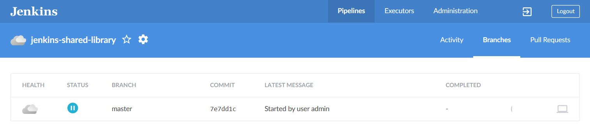
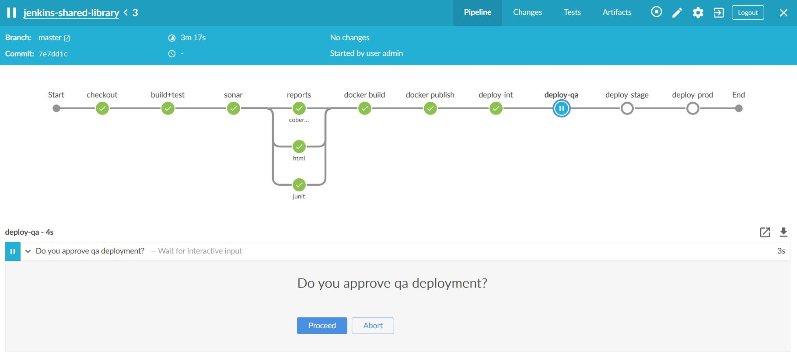
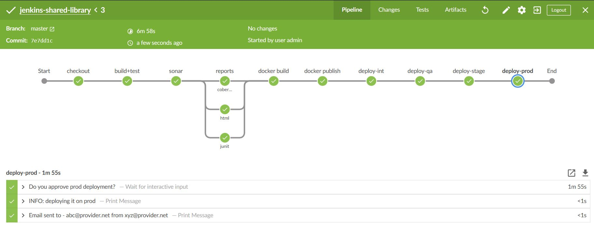
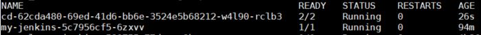

# jenkins-shared-library
This library is good start for anyone who is interested in learning and creating Glabal Jenkins Shared Library.

This library will work on Jenkins setup on Kubernetes and will create dynamic slave pods on-demand.
      
## Control Flow
Jenkinsfile --> ci.groovy --> cd.groovy

## Useful Links
- [K8s Plugin](https://github.com/jenkinsci/kubernetes-plugin)
- [Extending with Shared Libraries](https://jenkins.io/doc/book/pipeline/shared-libraries/)

## Screen Prints

### Jenkins Job View

### Continuous Delivery Flow

### Continuous Deployment Flow

### Behind the Scene
In the screen-print below, 1st row represts dynamic slaves and 2nd row represents Jenkins itself in K8s cluster

## Disclaimer
This jenkins-shared-library is for beginners and for learning purpose. There are lot many features to be added to make this jenkins-shared-library production ready.

